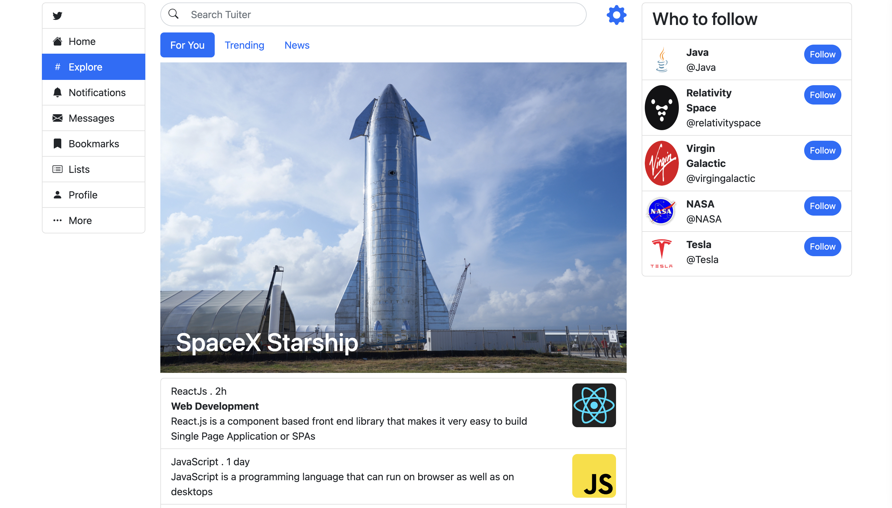

# Twitter Clone React Application

This repository contains a Twitter clone web application built using React.js, Bootstrap, JavaScript, Node.js, Express.js, and MongoDB. The project aims to replicate the core functionality of Twitter, allowing users to create accounts, log in, and interact with tweets.

## Features

- **User Authentication**: Users can sign up and log in to the application, securing their personal data and tweets.

- **Home Page**: The application features a home page that displays general information or tweets from different users.

- **Tweet Creation**: Authenticated users can compose and publish their tweets, sharing their thoughts with others.

- **Like/Unlike Tweets**: Users can express their appreciation for tweets by liking them. They can also unlike tweets if they change their minds.

- **Edit Personal Information**: Users have the ability to update their personal information, allowing them to keep their profile up to date.

## Technologies Used

The project utilizes a range of technologies, including:

- **Frontend**: React.js is used to build the user interface, ensuring an interactive and responsive experience. Bootstrap is employed for styling and layout purposes.

- **Backend**: The backend of the application is powered by Node.js and Express.js, handling requests and serving data to the frontend.

- **Database**: MongoDB serves as the database to store user information, tweets, and likes.

## How to Run

To run the application locally, follow these steps:

1. Ensure you have Node.js and MongoDB installed on your machine.

2. Clone the repository to your local system using the command `git clone <repository-url>`.

3. Navigate to the project directory in your terminal.

4. Install the required dependencies by running `npm install`.

5. Set up MongoDB and ensure it is running locally or hosted on a cloud service. Update the MongoDB connection URI in the backend code accordingly.

6. Start the backend server (You can find server repo on my Github - tuiter-node-server-app) by running `npm start` in the backend directory.

7. Start the frontend application by running `npm start` in the frontend directory.

8. Access the application in your web browser at `http://localhost:3000`.
